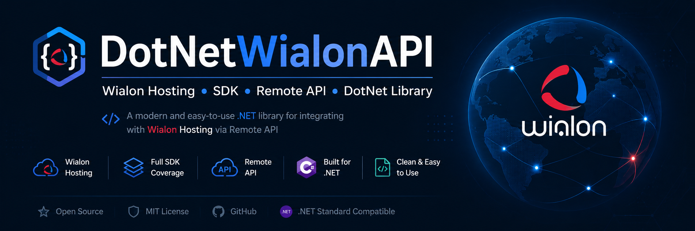

[English](README.md) | **Русский**


<h1 align="center">.Net Wialon API Library</h1>
<h3 align="center">Wialon Hosting • SDK • Remote API • DotNet Library</h3>


# Wialon API SDK для .NET (C#)

> [!IMPORTANT]
> ### ⚠️ ВНИМАНИЕ: ОБЯЗАТЕЛЬНО К ОЗНАКОМЛЕНИЮ — [SECURITY.MD](SECURITY.ru.md)!
> Перед началом работы с библиотекой **настоятельно рекомендуется внимательно изучить документ [SECURITY.md](SECURITY.ru.md)**.
> Проект находится на этапе **активного тестирования и валидации**. Использование библиотеки осуществляется **исключительно на ваш собственный страх и риск**.

Полнофункциональная асинхронная клиентская библиотека (SDK) на C# (.NET 8.0) для взаимодействия с Wialon Remote API (Wialon Hosting и Wialon Local).

---

## 🚀 Возможности

- **Полное покрытие API Wialon**: 13 специализированных сервисов:
  - `Core` (`core/*`) — авторизация, поиск объектов/пользователей/ресурсов (`search_item`, `search_items`), пакетные запросы (`batch`), создание объектов, проверка уникальности.
  - `Items` (`item/*`) — редактирование свойств, переименование, кастомные и административные поля, лог.
  - `Units` (`unit/*`) — управление свойствами объектов, расчетные флаги, задачи.
  - `Users` (`user/*`) — управление пользователями, права доступа, пароли, локаль.
  - `Resources` (`resource/*`) — геозоны, водители, прицепы, уведомления, задания, точки POI.
  - `Messages` (`messages/*`) — выгрузка телематических сообщений, SMS, команд, событий по интервалам или N последних.
  - `Reports` (`report/*`) — выполнение отчётов, получение структуры таблиц и строк, выгрузка результатов.
  - `Events` (`events/*`) — подписка на события в реальном времени, проверка обновлений (`check_updates`).
  - `Tokens` (`token/*`) — управление API-токенами, создание с правами доступа, удаление.
  - `Retranslators` (`retranslator/*`) — управление ретрансляторами и статистикой.
  - `Files` (`file/*`) — работа с файловым хранилищем Wialon.
  - `Exchange` (`exchange/*`) — импорт и экспорт данных и сообщений в JSON.
  - `Render` (`render/*`) — работа со слоями карты и рендерингом треков.
- **Строгая типизация**: Модели `Unit`, `Position`, `Message`, `GeoZone`, `Driver`, `SearchResult<T>`, `Session` и др.
- **Обработка ошибок**: Автоматический разбор `{"error": <code>}` в типизированные исключения `WialonException` с перечислением `WialonErrorCode`.
- **Автоматический Retry**: Повторная отправка при ошибке превышения частоты запросов (`1003`).
- **Песочница**: Интерактивная консольная среда `Wialon.Sandbox` для обкатки всех сценариев.
- **Юнит-тесты**: Набор тестов с мокированием HTTP без обращения к боевому серверу.

---

## 📦 Структура решения

```
Wialon API SDK/
├── src/
│   └── Wialon.Sdk/         # Основная библиотека классов (.NET 8)
├── tests/
│   └── Wialon.Sdk.Tests/   # Набор xUnit юнит-тестов
├── sandbox/
│   └── Wialon.Sandbox/     # Интерактивная консольная песочница
├── .env                    # Токен и URL хоста (не коммитится)
├── .env.example            # Пример конфигурации
├── SECURITY.md             # Политика безопасности и отказ от ответственности
└── Wialon.sln              # Solution файл
```

---

## ⚙️ Настройка и конфигурация

Создайте или отредактируйте файл `.env` в корне проекта:

```env
# 72-значный токен доступа Wialon
WIALON_ACCESS_TOKEN=your_72_character_token_here

# Хост Wialon (по умолчанию hst-api.wialon.com или адрес вашего Wialon Local)
WIALON_API_HOST=https://hst-api.wialon.com
```

### Как получить Access Token:
Перейдите по ссылке в браузере (замените `<host>` на ваш адрес Wialon):
```
https://<host>/login.html?client_id=MyApp&access_type=-1&duration=0
```

---

## 💻 Быстрый старт

### Инициализация и вход

```csharp
using Wialon.Sdk;

// Вариант 1: Из переменных окружения (.env)
var client = WialonClient.FromEnvironment();
var session = await client.LoginAsync();

// Вариант 2: С явной передачей параметров
var client = new WialonClient(new WialonClientOptions
{
    Host = "https://hst-api.wialon.com",
    AccessToken = "your_token"
});
await client.LoginAsync();
```

### Поиск объектов

```csharp
// Поиск всех объектов по маске
var searchResult = await client.Core.SearchUnitsAsync("*");
foreach (var unit in searchResult.Items)
{
    Console.WriteLine($"Объект: {unit.Name}, ID: {unit.Id}");
}

// Получение одного объекта с его последней позицией
var unitWithPos = await client.Core.SearchUnitAsync(12345, flags: 1025);
if (unitWithPos?.Position != null)
{
    Console.WriteLine($"Координаты: {unitWithPos.Position.Latitude}, {unitWithPos.Position.Longitude}");
    Console.WriteLine($"Скорость: {unitWithPos.Position.Speed} км/ч");
}
```

### Загрузка телематических сообщений

```csharp
// Загрузка 10 последних сообщений
var messages = await client.Messages.LoadLastAsync(unitId: 12345, lastCount: 10);
foreach (var msg in messages.Messages)
{
    Console.WriteLine($"[{msg.DateTime}] Скорость: {msg.Position?.Speed}, Топливо: {msg.Parameters?["fuel"]}");
}
```

### Выполнение пакетных запросов (Batch)

```csharp
var results = await client.Core.BatchAsync(new[]
{
    new BatchRequest { Svc = "core/check_unique", Params = new { type = "user", value = "admin" } },
    new BatchRequest { Svc = "token/list", Params = new { } }
});
```

---

## 🧪 Запуск тестов

```bash
dotnet test
```

---

## 🎮 Запуск песочницы

```bash
dotnet run --project sandbox/Wialon.Sandbox
```

---

## 🔒 Безопасность (Security)

Обязательно изучите документ [SECURITY.md](SECURITY.ru.md), регламентирующий политику безопасности, рекомендации по обращению с токенами доступа и отказ от ответственности.

> **Напоминание:** Всегда тщательно тестируйте сценарии работы с API в изолированной песочнице и\или тестовой среде(Отдельная учетная запись, отдельный ресурс, отдельные объекты, для предотвращения потери или повреждения данных, блокировки учетных записей и тд.) перед интеграцией в производственные системы.
